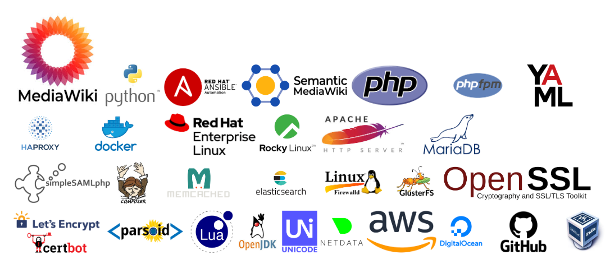

# Meza

Setup an enterprise MediaWiki server with **simple commands**. Put all components on a single monolithic server or split them out over many. Run a solitary master database or have replicas. Deploy to multiple environments. Run backups. Do it all using the `meza` command. Run `meza --help` for more info.

## Why Meza?

Standard MediaWiki is easy to install, but increasingly its newer and better features are contained within extensions that are more complicated. Additionally, they may be particularly difficult to install on Enterprise Linux derivatives. This project aims to make these features (VisualEditor, CirrusSearch, etc) easy to *install, backup, reconfigure, and maintain* in a robust and well-tested way.

## Requirements

1. Rocky Linux 8 or RHEL 8 (for now, with Debian support in the works)
2. Minimal install: Attempting to install it on a server with many other things already installed may not work properly due to conflicts.

## Install and usage

See all the Meza documentation at https://www.mediawiki.org/wiki/Meza

## Contributing

If you'd like to contribute to this project, please see [this guide on how to help](CONTRIBUTING.md).
