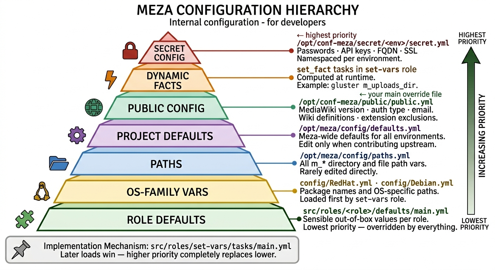

# Meza Configuration Management

## No `meza config` Command Available

There is no `meza config` command in the current implementation. Such a command would require:

- A complex configuration management system
- Direct YAML file manipulation capabilities
- Environment-aware key/value storage
- Integration with Meza's multi-layered configuration hierarchy

This level of complexity doesn't align with Meza's current architecture, which is designed around direct file editing and Ansible-based configuration management.

## Managing config in Meza

Here is how Meza provides configuration management (get/set/apply):

### View Configuration Values

Use the `meza debug` command to view any configuration variable:

```bash
# View a specific configuration value
meza debug monolith mediawiki_version

# View database configuration
Meza database configuration starts with the 'inventory' file

# View all wikis configured
meza debug production list_of_wikis

# View backup settings
meza debug monolith m_backup_retention_days
```

Remember that it is fast and useful to just grep the two code paths:
`grep -r is_this_even_real /opt/conf-meza /opt/meza'

### Set Configuration Values

Edit configuration files directly using your preferred editor:

```bash
# Edit public (non-sensitive) farm configuration
sudo vi /opt/conf-meza/public/public.yml

# Edit secret (sensitive) configuration namespaced by environment target
sudo vi /opt/conf-meza/secret/monolith/secret.yml

# Edit global app defaults (affects all environments)
# This is only for changes to the project itself
sudo vi /opt/meza/config/defaults.yml
```

### Apply Configuration Changes

Deploy the environment to apply configuration changes:

```bash
# Apply all configuration changes
meza deploy monolith

# Apply only configuration changes (faster, skips updates)
meza deploy monolith --tags mediawiki --skip-tags latest,update.php
```

## Configuration File Hierarchy



Meza uses the layered configuration system offered by ansible. Variables are loaded from the base of the pyramid to the top, illustrated in the 'Meza Configuration Hierarchy graphic above;
**last value wins**, so layers at the top override lower ones. Edits are typically managed in the 'public' layer. Only developers
change layers below 'public' (making them available for override). Values in 'secrets' win, but are determined at setup
and therefore not normally editted by hand.

> **Implementation reference**: `src/roles/set-vars/tasks/main.yml` is the authoritative
> source for this load order. Variables are loaded via `ansible.builtin.include_vars`;
> a variable defined in a later file completely replaces the same variable from an
> earlier file.

### Role defaults (`defaults/main.yml`)

Each Ansible role (e.g. `haproxy`, `apache`, `database`) may ship a
`defaults/main.yml` file containing sensible out-of-the-box values for that
role's variables. These are Ansible **role defaults** — the lowest-priority
variable source in the entire system. Every file in the `include_vars`-based
stack above unconditionally wins over them.

A role default is active only when the variable has not been set anywhere in
the config file hierarchy. To override any role default, add the variable to
`/opt/conf-meza/public/public.yml` (non-sensitive) or
`/opt/conf-meza/secret/<env>/secret.yml` (if it should be encrypted). This is also what the
comment at the top of files like `src/roles/haproxy/defaults/main.yml` means
when it says:

> *Override any of these in `conf-meza/public/public.yml` or `secret/<env>/secret.yml`*

### What to override and where
- **`secret.yml`** — sensitive values only: passwords, API keys, FQDN, SSL config.
- **`public.yml`** — the intended place for all local customization: MediaWiki version,
  auth type, email settings, wiki definitions, extension exclusions, profiling,
  and overrides for any role default.
- **`defaults.yml`** — Meza project defaults; edit only when contributing upstream changes.
- **OS-family YAMLs** — OS-specific variants for paths, package names etc.
- **`roles/<role>/defaults/main.yml`** — role-specific defaults; edit only when
  contributing upstream changes to that role.

## Common Configuration Examples

### MediaWiki Version
```yaml
# In /opt/conf-meza/public/public.yml
mediawiki_version: "1.39.4"
```

### Backup Configuration
```yaml
# In /opt/conf-meza/public/public.yml
m_backup_retention_days: 30
m_backup_enable: true
```

## See Also

- [`meza debug`](debug.md) - View configuration values and variables
- [`meza deploy`](deploy.md) - Apply configuration changes
- [`meza setup`](setup.md) - Environment setup and initial configuration
